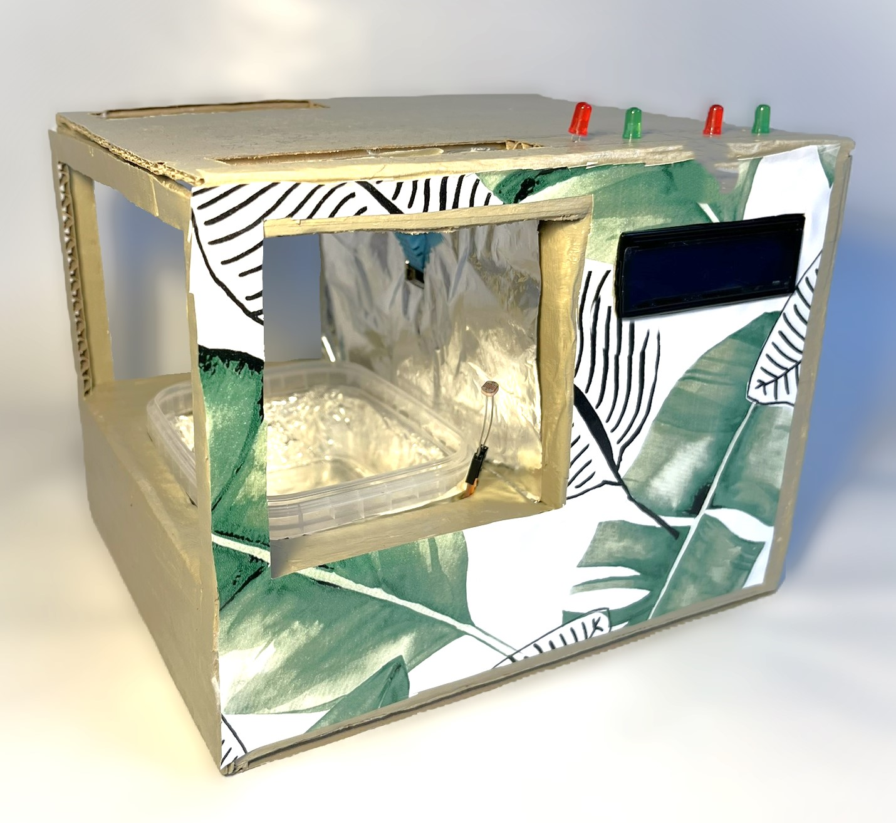
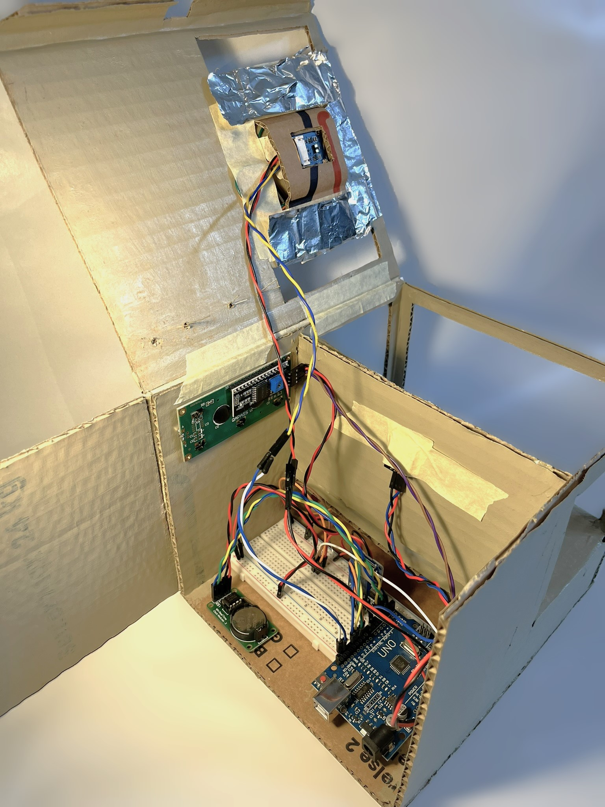

# Projektdefinering

Dette projekt er lavet i forbindelse med kurset `Data Science` og omhandler dataopsamling, exploratory dataanalyse og datakommunikation.

Her findes informationerne omkring gruppen der har lavet dette projekt

|                 |                  |
|-----------------|------------------|
| Gruppemedlemmer | Regitze og Silje |
| Studieretning   | Biologi          |
| Alias           | Regilje          |

: Information om gruppe

# Projekt

## Omkring forsøg

Formålet med projektet er at undersøge hvilke forhold der optimale for karses vækst. Vores forsøg har følgende måleenheder tilsluttet: afstand, lys intensitet, fugtighed og temperatur. Derudover var det også planen at have 4 LED dioder der indikerede om forholdene (temperatur og fugt) for karse vækst er optimale. Dette nåede vi desværre ikke at implementere helt.

## Forsøgsopsætning {.tabset}

### Udvendigt

```{r, echo=FALSE, out.width="75%", fig.cap="**Figur 1:** Forsøgsopstilling set udefra.", fig.align='center'}

```

### Indvendigt

```{r, echo=FALSE, out.width="75%", fig.cap="**Figur 2:** Indevendige del af forsøgsopstillingen.", fig.align='center'}

```

##  {.unnumbered}

For at bestemme de bedste vækstforhold lavede vi tre delforsøg: 1) et forsøg hvor karsen fik naturligt lys (`Karse_N`), 2) et forsøg hvor karsen kun stod i mørke (`Karse_M`), 3) et forsøg hvor karsen fik konstant kunstigt lys (`Karse_K`).

## Opsætning af data

### Libraries

Her ses alle de pakker der er nødvendig for at kunne repliklere koden fra dette projekt.

```{r message=FALSE}
library(tidyverse)
library(lubridate)
library(moderndive)
library(knitr)
library(grid)
library(ggthemes)
library(scales)
```

### Indlæs data

I alle forsøg, blev karsens vækst beregnet ud fra afstanden. Afstandsmåleren sad over karsen, og i takt med at karsen voksede, ville den målte afstand blive mindre. Væksten bestemmedes som `max(Afstand) - Afstand`. Ved indlæsningen af data fra hvert forsøg bliver lys intensiteten `Lys` regnet om til procenter `Lys_pct`, dato og tidspunkt `DatoTid` bliver regnet om til hvor lang tid der er gået fra eksperimentets start `delta_tid`, og væksten bliver regnet til en gennemsnits værdi for hver 5. minut.

#### Karse naturligt lys

Først indlæses data fra det første forsøg - forsøget hvor karsen fik naturligt lys. Dvs. at karsen fik lys om dagen, og mørke om natten. Her bliver der fjernet en tydeligt outlier hvor afstanden var længere end muligt ved vores forsøg.

```{r message=FALSE, warning=FALSE}
Karse_N <- read_delim(file = "data/KARSELOG.TXT", delim = "\t",
                      col_types = list(DatoTid = "c",
                                       Temperatur = "d",
                                       Luftfugtighed = "d",
                                       Afstand = "d",
                                       Lys = "d")) %>% 
  filter(DatoTid != "Dato") %>% 
  filter(Afstand < 135)

Karse_N <- Karse_N %>% 
  filter(DatoTid != "2000-00-00T00:00:00") %>% 
  mutate(Eksperiment = "Karse normal",
         DatoTid = ymd_hms(DatoTid),
         Dato_min = round_date(DatoTid, unit = "5 mins"),
         Vækst = max(Afstand) - Afstand,
         Lys_pct = (Lys - min(Lys))/(max(Lys) - min(Lys))*100) %>% 
  select(Dato_min, Temperatur, Vækst, Lys_pct, Eksperiment) %>% 
  pivot_longer(cols = c(Temperatur, Vækst, Lys_pct)) %>% 
  group_by(Dato_min, name, Eksperiment) %>% 
  summarise(mean = mean(value)) %>% 
  ungroup() %>% 
  mutate(delta_tid = Dato_min - ymd_hms("2024-02-27 21:30:00"))

kable(head(Karse_N))
```

#### Karse i mørke

Herefter indlæses data fra mørke forsøget hvor karsen blev holdt under konstant mørke. Vi valgte at sætte vores ind i et skab.

```{r message=FALSE, warning=FALSE}
Karse_M <- read_delim(file = "data/KARSELOG_M.TXT", delim = "\t",
                      col_types = list(DatoTid = "c",
                                       Temperatur = "d",
                                       Luftfugtighed = "d",
                                       Afstand = "d",
                                       Lys = "d")) %>% 
  filter(DatoTid != "Dato")

Karse_M <- Karse_M %>% 
  filter(DatoTid > "2024-03-05T14:05:00") %>% 
  mutate(Eksperiment = "Karse mørke",
         DatoTid = ymd_hms(DatoTid),
         Dato_min = round_date(DatoTid, unit = "5 mins"),
         Vækst = max(Afstand) - Afstand,
         Lys_pct = (Lys - min(Lys))/(max(Lys) - min(Lys))*100) %>% 
  select(Dato_min, Temperatur, Vækst, Lys_pct, Eksperiment) %>% 
  pivot_longer(cols = c(Temperatur, Vækst, Lys_pct)) %>% 
  group_by(Dato_min, name, Eksperiment) %>% 
  summarise(mean = mean(value)) %>% 
  ungroup() %>% 
  mutate(delta_tid = Dato_min - ymd_hms("2024-03-06 09:25:00"))

kable(head(Karse_M))
```

#### Karse i kunstig lys

Herefter indlæses data fra forsøget hvor karsen blev groet under konstant kunstigt lys. Vi valgte at sætte karsen ind i et skab sammen med en skrivebordlampe. Der ved bliver lysindfaldet holdt konstant da der ikke kommer lys fra andre kilder som evt. kunne svinge i intensitet.

```{r message=FALSE, warning=FALSE}
Karse_K <- read_delim(file = "data/KARSELOG_K.TXT", delim = "\t",
                      col_types = list(DatoTid = "c",
                                       Temperatur = "d",
                                       Luftfugtighed = "d",
                                       Afstand = "d",
                                       Lys = "d")) %>% 
  filter(DatoTid != "Dato")

Karse_K <- Karse_K %>% 
  filter(DatoTid != "2000-00-00T00:00:00") %>% 
  mutate(Eksperiment = "Karse kunstig",
         DatoTid = ymd_hms(DatoTid),
         Dato_min = round_date(DatoTid, unit = "5 mins"),
         Vækst = max(Afstand) - Afstand,
         Lys_pct = (Lys - min(Lys))/(max(Lys) - min(Lys))*100) %>% 
  select(Dato_min, Temperatur, Vækst, Lys_pct, Eksperiment) %>% 
  pivot_longer(cols = c(Temperatur, Vækst, Lys_pct)) %>% 
  group_by(Dato_min, name, Eksperiment) %>% 
  summarise(mean = mean(value)) %>% 
  ungroup() %>% 
  mutate(delta_tid = Dato_min - ymd_hms("2024-03-11 15:40:00"))

kable(head(Karse_K))
```

## Kombiner data

For lettere at kunne arbejde med alt det indsamlede data bliver det samlet i en enkelt data frame.

```{r}
d <- rbind.data.frame(Karse_N, Karse_M, Karse_K) %>% 
  mutate(delta_tid = as.numeric(delta_tid)/3600)
```

## Tema valg

For at lave alle grafer visuelt sammenhængende defineres et fælles tema. Valget af vores tema blev gjord ud fra et professionelt udseende og sammenhæng med resten af rapporten. Vi blev inspireret af denne artiklen omkring professionelle grafer i ggplot2 [ggplot2 themes for publication ready plots](https://medium.com/analytics-vidhya/ggplot2-themes-for-publication-ready-plots-including-dark-themes-9cd65cc5a7e3) og omskrev deres kode til vores egne ønsker.

```{r}
karseTema <- function(base_size = 14, base_family = "sans") {
      theme_foundation(base_size = base_size, base_family = base_family) +
          theme(plot.title = element_text(face = "bold",
                                         size = rel(1.5), hjust = 0.5),
               text = element_text(),
               panel.background = element_rect(colour = NA),
               plot.background = element_rect(colour = NA),
               panel.border = element_rect(colour = NA),
               axis.title = element_text(face = "bold", size = rel(1)),
               axis.title.y = element_text(angle = 90, vjust = 2),
               axis.title.x = element_text(vjust = -0.2),
               axis.text = element_text(), 
               axis.line.x = element_line(colour = "black"),
               axis.line.y = element_line(colour = "black"),
               axis.ticks = element_line(),
               panel.grid.major = element_line(colour = "#f0f0f0"),
               panel.grid.minor = element_blank(),
               legend.key = element_rect(colour = NA),
               legend.position = "bottom",
               legend.direction = "horizontal",
               legend.key.size = unit(0.2, "cm"),
               legend.margin = margin(0, unit = "cm"),
               legend.title = element_text(face = "italic"),
               plot.margin = unit(c(10, 5, 5, 5), "mm"),
               strip.background = element_rect(colour = "#f0f0f0", fill = "#f0f0f0"),
               strip.text = element_text(face = "bold")
       )
      }

scale_fill_karseTema <- function(...){
  discrete_scale("fill", "Karse", manual_pal(values = c("#5089d4","#fdb462","#7fc97f")), ...)
}
  
scale_color_karseTema <- function(...){
  discrete_scale("color", "Karse", manual_pal(values = c("#5089d4","#fdb462","#7fc97f")), ...)
}
```

## Overbliksfigur
De tre karsefosøg samles i en figur, så lysintensiteten, temperaturen og væskten kan sammenlignes. 

```{r fig.height=8, warning=FALSE}
dp <- d %>% 
  mutate(name = fct_relevel(as.factor(name), c("Lys_pct", "Temperatur", "Vækst"))) %>%
  mutate(name = recode(name, 
                       "Vækst" = "Vækst [cm]", 
                       "Lys_pct" = "Lysintensitet [%]", 
                       "Temperatur" = "Temperature [°C]"))

ggplot(dp, aes(x = delta_tid, y = mean, color = Eksperiment)) +
  geom_point() +
  facet_grid(rows = "name", scales = "free_y") +
  labs(title = "Overbliksfigur af karse data",
       subtitle = "Udført af Regitze C. Skibsted og Silje M. Lund",
       caption = "Karsen er groet udenfor et lab, så må gerne spises.\nAalborg Universitet, forår 2024") +
  xlab("Tid (h)") +
  ylab("Værdi") +
  karseTema() +
  scale_color_karseTema()
```

## Lineær regression
Vi valgte at lave en regression over det samme vindue i alle grafer mellem 50 og 74 timer efter forsøgets start. Dette valg skyldes at det var et tidsrum hvor der skete vækst i alle eksperimenter og det var indenfor det data vi havde for eksperimentet med kunstigt lys.

```{r fig.height=7, warning=FALSE}
dw <- d %>% 
  pivot_wider(names_from = name, values_from = mean)

dw_subset <- dw %>% 
  filter(!(Eksperiment == "Karse normal" & (delta_tid < 50 | delta_tid > 74))) %>%
  filter(!(Eksperiment == "Karse mørke" & (delta_tid < 50 | delta_tid > 74))) %>% 
  filter(!(Eksperiment == "Karse kunstig" & (delta_tid < 50 | delta_tid > 74)))
```

### Lineær regression ved brug af `lm()`

Man kan ikke aflæse hældinger fra den ’lineær regression ggplot’. Derfor udarbejdes der også en lineær regression vha. `lm` først som vi kan bruge til at have mere information til vores grafer.
```{r}
lm_Karse_N <- lm(data = dw_subset %>%
  filter(Eksperiment == "Karse normal"), formula = Vækst~delta_tid)
lm_Karse_M <- lm(data = dw_subset %>%
  filter(Eksperiment == "Karse mørke"), formula = Vækst~delta_tid)
lm_Karse_K <- lm(data = dw_subset %>%
  filter(Eksperiment == "Karse kunstig"), formula = Vækst~delta_tid)
```

```{r}
lm_Karse_N_table <- get_regression_table(lm_Karse_N, digits = 3) %>% mutate(Eksperiment = "Karse normal")
lm_Karse_M_table <- get_regression_table(lm_Karse_M, digits = 3) %>% mutate(Eksperiment = "Karse mørke")
lm_Karse_K_table <- get_regression_table(lm_Karse_K, digits = 3) %>% mutate(Eksperiment = "Karse kunstig")
lm_rt <- rbind.data.frame(lm_Karse_N_table, lm_Karse_M_table, lm_Karse_K_table) %>% filter(term == "delta_tid")

lm_Karse_N_rs <- get_regression_summaries(lm_Karse_N, digits = 3) %>% mutate(Eksperiment = "Karse normal")
lm_Karse_M_rs <- get_regression_summaries(lm_Karse_M, digits = 3) %>% mutate(Eksperiment = "Karse mørke")
lm_Karse_K_rs <- get_regression_summaries(lm_Karse_K, digits = 3) %>% mutate(Eksperiment = "Karse kunstig")
lm_rs <- rbind.data.frame(lm_Karse_N_rs, lm_Karse_M_rs, lm_Karse_K_rs)

lm_stats <- cbind.data.frame(lm_rt %>% select(Eksperiment, slope = estimate, lower_ci, upper_ci), lm_rs %>% select(r_squared))
```

### Plot residualer
Fra `lm` har vi beregnet residualer. 
```{r fig.height=6}
lm_karse_N_rp <- get_regression_points(lm_Karse_N) %>% mutate(experiment = "Karse normal")
lm_karse_M_rp <- get_regression_points(lm_Karse_M) %>% mutate(experiment = "Karse mørke")
lm_karse_K_rp <- get_regression_points(lm_Karse_K) %>% mutate(experiment = "Karse kunstig")

rp <- rbind.data.frame(lm_karse_N_rp, lm_karse_M_rp, lm_karse_K_rp)

ggplot(rp, aes(x=residual, group = experiment, fill = experiment)) +
  geom_histogram(bins = 30) +
  labs(title = "Residualer",
       subtitle = "Udført af Regitze C. Skibsted og Silje M. Lund",
       caption = "Karsen er groet udenfor et lab, så må gerne spises.\nAalborg Universitet, forår 2024") +
  xlab("Residualer") +
  ylab("Antal obs.") +
  facet_wrap(~experiment) +
  karseTema() +
  scale_fill_karseTema()
```

### Lineær regression ved brug af ggplot
Ud fra vækstkurven beregnede vi en lineær regression på vækstkurven, for at sammenligne væksten.
`Karse_K` havde færre datapunkter end de andre forsøg, fordi der var problemer med uret. Vi brugte det samme subset som tidligere.
```{r fig.height=7}
ggplot(dw, aes(x = delta_tid, y = Vækst, group = Eksperiment, color = Eksperiment)) +
  geom_point() +
  geom_smooth(data = dw_subset, method = "lm", color = "black", linewidth = 1, se = F) +
  labs(title = "Lineær regression ved brug af ggplot",
       subtitle = "Udført af Regitze C. Skibsted og Silje M. Lund",
       caption = "Karsen er groet udenfor et lab, så må gerne spises.\nAalborg Universitet, forår 2024") +
  xlab("Tid (h)") +
  ylab("Vækst (mm)") +
  facet_grid(rows = "Eksperiment", scales = "free_y") +
  geom_text(data = lm_stats, aes(x = 0.5, y = 40, label = paste("Vækstrate:", slope*10, "mm/time, ", r_squared, " r^2")),
              hjust = 0, color = "grey50") +
  karseTema() +
  scale_color_karseTema()
```


## Tabel med ekstraheret statestikker
Neden under ses en tabel med statistikker fra den lineær regression.

```{r}
exp_stats <- dw %>% group_by(Eksperiment) %>% 
  summarise(max_growth = round(max(Vækst, na.rm = T),2), 
            mean_temp = round(mean(Temperatur, na.rm = T),1))

stats <- left_join(lm_stats, exp_stats, by = "Eksperiment")

kable(stats, caption = "Lineær regression - Statestikker")
```

Derudover finder vi også den maksimale højde som karsen har groet i de forskellige eksperimenter.

```{r}
max <- d %>% 
  group_by(Eksperiment) %>% 
  summarise(max(mean))

kable(max, caption = "Max karse højde")
```


## Metodiske overvejelser

I dette projekt havde vi desværre flere problemer med de forskellige sensorer og mange tidspunkter hvor der ikke blev gemt data. Dette har givet store huller. Ved kunstigt lys ser man at der ikke er særligt mange resultater hvilket skyldes nogen af disse problemer.
Vores lys sensor virkede kun ved det kunstige lys forsøg og ved de andre blev der registreret en næsten konstant værdi på 30. 

Hvis vi skulle lave dette projekt en gang til ville vi sikre os at alle sensorer fungere og vi skulle finde en måde så chancen for at miste data blev mindsket.

Vi ville gerne havde haft lys dioder på der viste når temperatur og fugt var optimal for karse vækst. Det nåede vi dog ikke at få til at virke ordenligt så det ville vi også inddrage en anden gang.


# Arduino kode

Nedenunder ses vores arduino kode hvilket også kan findes på [GitHub](https://github.com/SiaLemons/Karse_DS2024). På GitHub kan resten af projektet også findes.

```{r}
readLines(con = "Karse_maaling/Karse_maaling.ino") %>%
  cat(sep = '\n')
```

# Informations om versioner

```{r}
sessionInfo()
```
